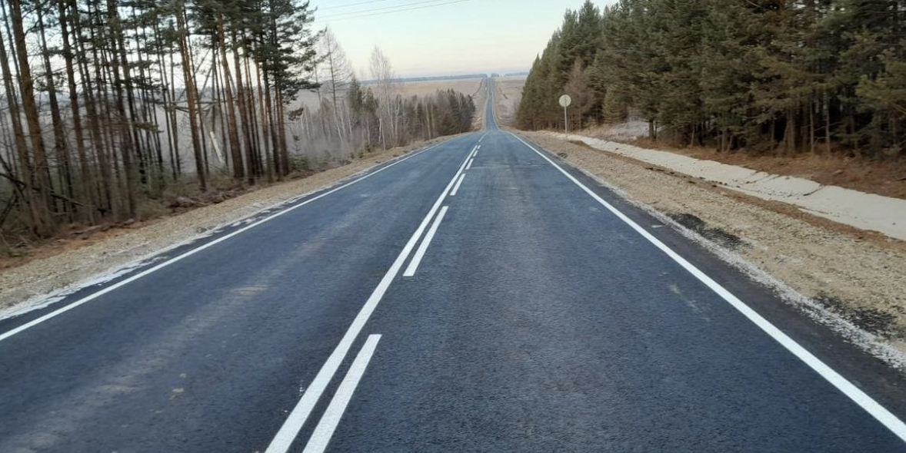

The code in the file `report.ipynb` searches for traffic lines in the image `road1.png` and outputs the vanishing point at the intersection of two traffic lines.

#### Original image

#### Result image:

